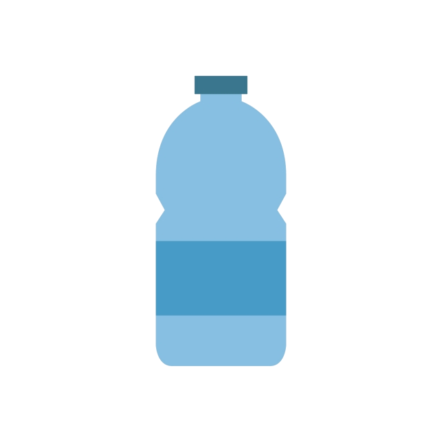

<!-- PROJECT SHIELDS -->
<!--
*** I'm using markdown "reference style" links for readability.
*** Reference links are enclosed in brackets [ ] instead of parentheses ( ).
*** See the bottom of this document for the declaration of the reference variables
*** for contributors-url, forks-url, etc. This is an optional, concise syntax you may use.
*** https://www.markdownguide.org/basic-syntax/#reference-style-links
-->
[![Contributors][contributors-shield]][contributors-url]
[![Forks][forks-shield]][forks-url]
[![Stargazers][stars-shield]][stars-url]
[![Issues][issues-shield]][issues-url]
[![MIT License][license-shield]][license-url]
[![LinkedIn][linkedin-shield]][linkedin-url]


<!-- PROJECT LOGO -->
<br />
<p align="center">
  <a href="https://github.com/elliotborryn/DrinkReminder">
    
  </a>

  <h3 align="center">Drink Water Reminder</h3>

  <p align="center">
    Get reminded to stay hydrated!
    <br />
    <a href="https://github.com/elliotborryn/DrinkReminder"><strong>Explore the docs »</strong></a>
    <br />
    <br />
    <a href="https://github.com/elliotborryn/DrinkReminder/issues">Report Bug</a>
    ·
    <a href="https://github.com/elliotborryn/DrinkReminder/issues">Request Feature</a>
  </p>
</p>


<!-- TABLE OF CONTENTS -->
## Table of Contents

* [About the Project](#about-the-project)
  * [Built With](#built-with)
* [Getting Started](#getting-started)
  * [Installation](#installation)
* [Usage](#usage)
* [Roadmap](#roadmap)
* [Contributing](#contributing)
* [Contact](#contact)


<!-- ABOUT THE PROJECT -->
## About The Project
Nowadays I mostly work at home and I have a lot of meetings, working with clients and colleagues which for I talk a lot. It is important to stay hydrated throughout they day and that's why I made a simple python script which shows me a toast notification that tells me to drink some water.

[![Notification Example][product-screenshot]](https://github.com/elliotborryn/DrinkReminder/blob/main/img/drinkReminderNotification.PNG)


### Built With

* [Python 3.9.0](https://www.python.org/downloads/release/python-390/)
* [Visual Code](https://code.visualstudio.com/)
* [win10toast-persist](https://pypi.org/project/win10toast-persist/)
* [Advanced Python Scheduler](https://apscheduler.readthedocs.io/en/stable/)


<!-- GETTING STARTED -->
## Getting Started

Notification will be send every 30 minutes. 
If you don't want to change this you can run DrinkReminder.exe in [dist folder](https://github.com/elliotborryn/DrinkReminder/tree/main/dist)

If you'd like to change interval please follow steps beneath.

### Installation

1. Clone the repo
```sh
git clone https://github.com/elliotborryn/DrinkReminder.git
```
2. Install libraries
* win10toast
```sh
pip install win10toast-persist
```
* APSchedular
```sh
pip install apscheduler
```


<!-- USAGE EXAMPLES -->
## Usage

Interval can be hours, minutes or seconds. Standard is every 30 minutes.

* hours=int
* minutes=int
* seconds=int

```python
#Setup Scheduler
scheduler = BlockingScheduler()
scheduler.add_job(reminder, 'interval', minutes=30)
scheduler.start()
```

<!-- ROADMAP -->
## Roadmap

See the [open issues](https://github.com/elliotborryn/DrinkReminder/issues) for a list of proposed features (and known issues).


<!-- CONTRIBUTING -->
## Contributing

Contributions are what make the open source community such an amazing place to be learn, inspire, and create. Any contributions you make are **greatly appreciated**.

1. Fork the Project
2. Create your Feature Branch (`git checkout -b feature/AmazingFeature`)
3. Commit your Changes (`git commit -m 'Add some AmazingFeature'`)
4. Push to the Branch (`git push origin feature/AmazingFeature`)
5. Open a Pull Request


<!-- CONTACT -->
## Contact

Project Link: [https://github.com/elliotborryn/DrinkReminder](https://github.com/elliotborryn/DrinkReminder)


<!-- MARKDOWN LINKS & IMAGES -->
<!-- https://www.markdownguide.org/basic-syntax/#reference-style-links -->
[contributors-shield]: https://img.shields.io/github/contributors/elliotborryn/DrinkReminder.svg?style=flat-square
[contributors-url]: https://github.com/elliotborryn/DrinkReminder/graphs/contributors
[forks-shield]: https://img.shields.io/github/forks/elliotborryn/DrinkReminder.svg?style=flat-square
[forks-url]: https://github.com/elliotborryn/DrinkReminder/network/members
[stars-shield]: https://img.shields.io/github/stars/elliotborryn/DrinkReminder.svg?style=flat-square
[stars-url]: https://github.com/elliotborryn/DrinkReminder/stargazers
[issues-shield]: https://img.shields.io/github/issues/elliotborryn/DrinkReminder.svg?style=flat-square
[issues-url]: https://github.com/elliotborryn/DrinkReminder/issues
[license-shield]: https://img.shields.io/github/license/elliotborryn/DrinkReminder.svg?style=flat-square
[license-url]: https://github.com/elliotborryn/DrinkReminder/blob/main/LICENSE.txt
[linkedin-shield]: https://img.shields.io/badge/-LinkedIn-black.svg?style=flat-square&logo=linkedin&colorB=555
[linkedin-url]: https://linkedin.com/in/elliot-borryn-941aba133
[product-screenshot]: img/drinkReminderNotification.PNG
